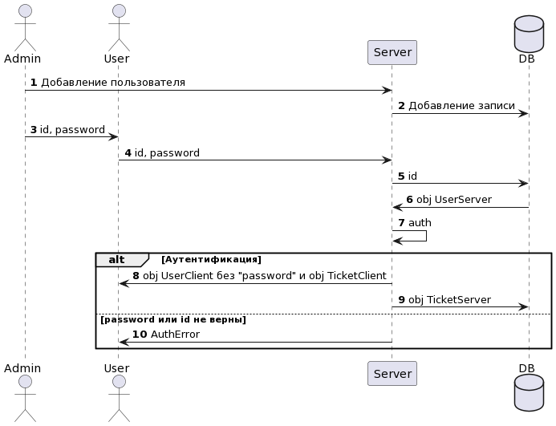
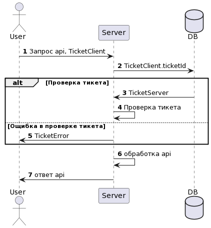

# Пользователи
На сервере:
	Добавить пользователя
	Удалить пользователя
В приложении:
	Аутентификация

## Class

	UserServer 
		id: Int
		name: String - Имя пользователя
		login: String - логин
		password: String - пароль НИКОГДА НЕ ХРАНИТСЯ НА КЛИЕНТЕ
		group: UserGroup - группа пользоватея

	UserClient 
		id: Int
		name: String 
		group: UserGroup - группа пользоватея

	UserGroup: Enum
		ADMIN
		ORGANIZER  
		STORAGE
		ARTIST
		VOLUNTEER
		PRESS

## Data base
	
	Users - table
	Tickets - table

### Preload data
Для того чтобы система сразу после запуска была готова к работе должны сушествовать предварительные данные.
Они должны быть написаны в формате который может быть прочтен человеком и должны быть загруженны в базу данных специальным скриптом.
	
## API 

	/api/auth

		/login
			role: [PRESS]
			-> 
				login: String
				password: String
			<- 
				400 -> Токен аутентификации
					token: String
				403 -> Bad credits

		/authorization
			role: [ADMIN]
			->
				name: String
				login: String
				password: String
				role: List<String>
			<-
				400 -> Пользователь создан
				403 FORBIDDEN -> Если роль запращиваюшего не верна

### Группы пользователей
* ADMIN - Создатель
* ORGANIZER - Организаторы фестиваля  
* STORAGE - Гаражные
* ARTIST - Художника
* VOLUNTEER - Волантеры
* PRESS - Пресслужба

Каждая верхняя группа расширяет права нижней.

### Авторитизация и аутентификация
Пользователи не могут сами зарегестрироватся в системе.
Пользователи могу ли аутентифицироватся в системе по предоставленной им паре (Логин пароль)
Для Аутентивицаии пользователей будет использоватся JWT токен.
<!---
@startuml
actor       Admin      as Admin
actor       User       as User
participant Server     as Server
database    DB         as DB

autonumber
Admin  -> Server : Добавление пользователя 
Server -> DB     : Добавление записи
Admin  -> User   : id, password
User   -> Server : id, password
Server -> DB     : id
DB     -> Server : obj UserServer
Server -> Server : auth

alt Аутентификация
    Server -> User   : obj UserClient без "password" и obj TicketClient
    Server -> DB     : obj TicketServer
else password или id не верны
    Server -> User   : AuthError
end
@enduml
-->

### Использование
<!---
@startuml
actor       User       as User
participant Server     as Server
database    DB         as DB

autonumber
User   -> Server : Запрос api, TicketClient 
Server -> DB     : TicketClient.ticketId

alt Проверка тикета
    DB     -> Server : TicketServer
    Server -> Server : Проверка тикета
else Ощибка в проверке тикета
    Server -> User   : TicketError
end

Server -> Server : обработка api
Server -> User   : ответ api
@enduml
-->

